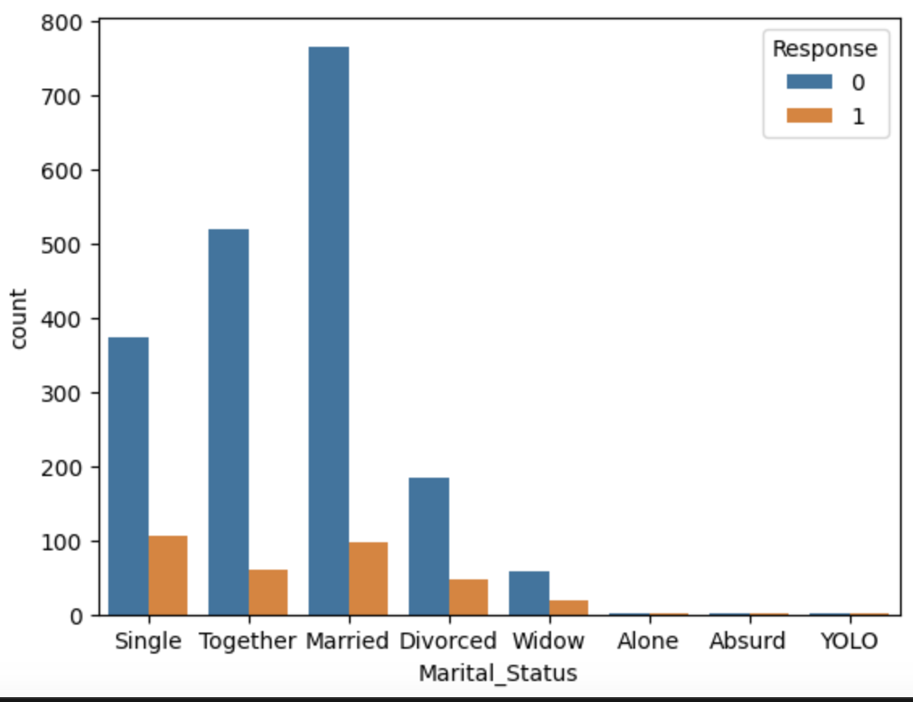
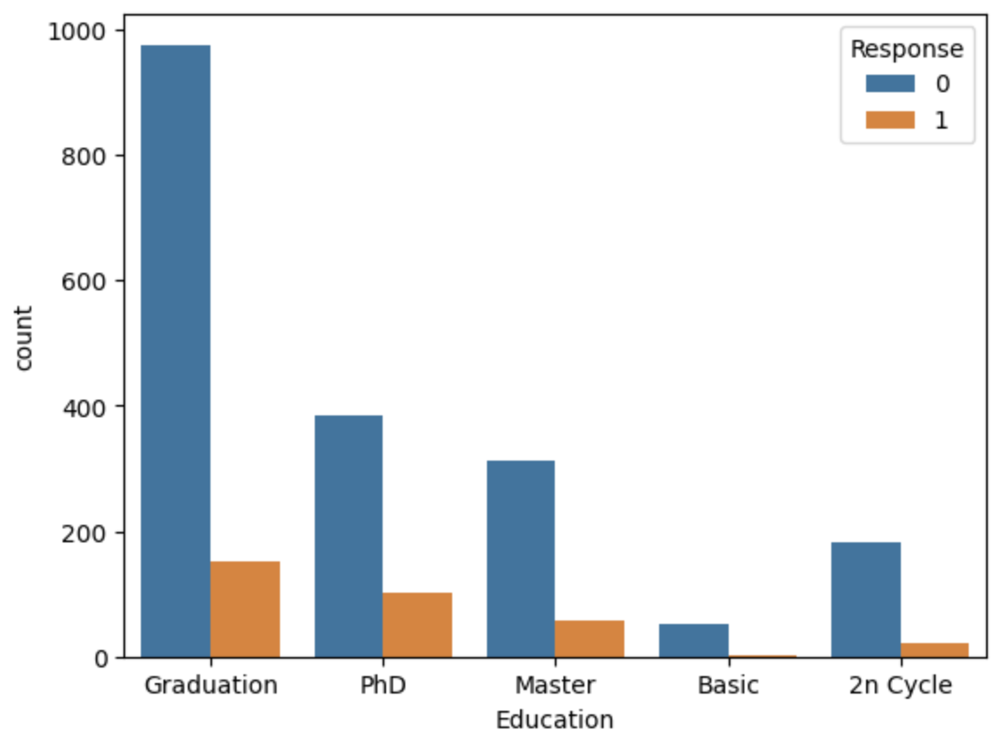
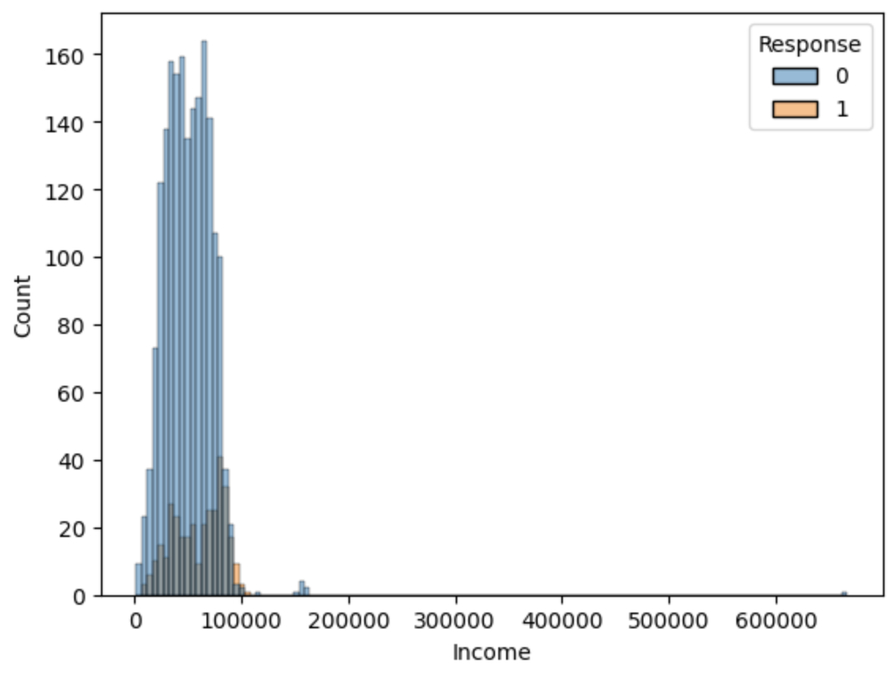
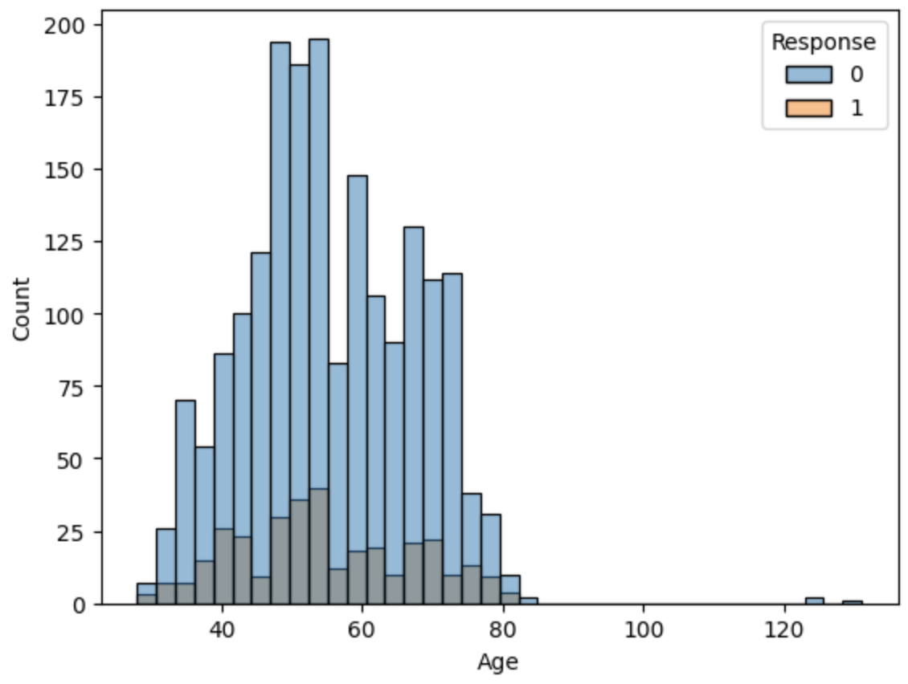
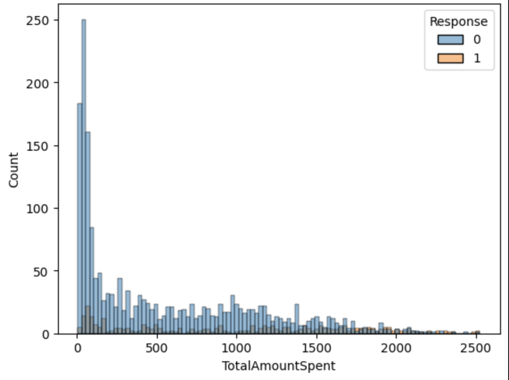
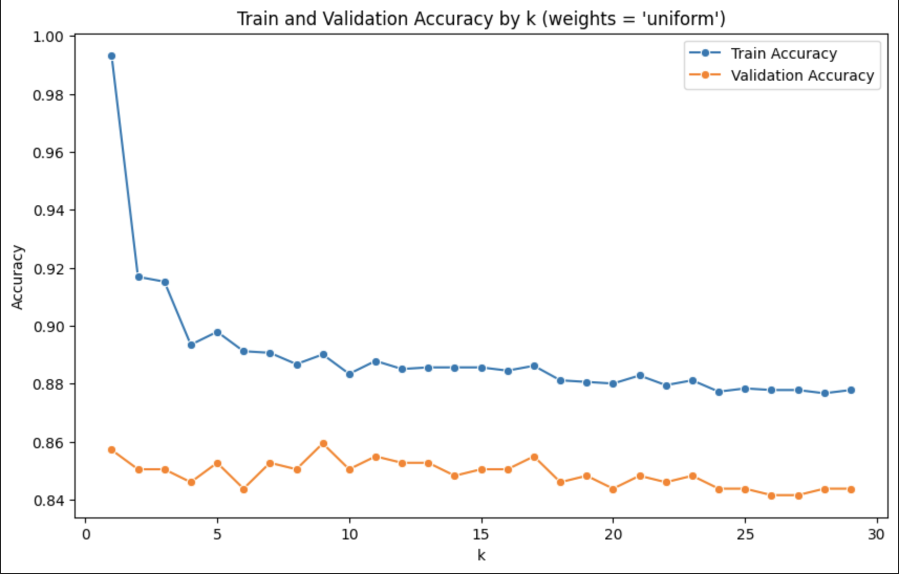
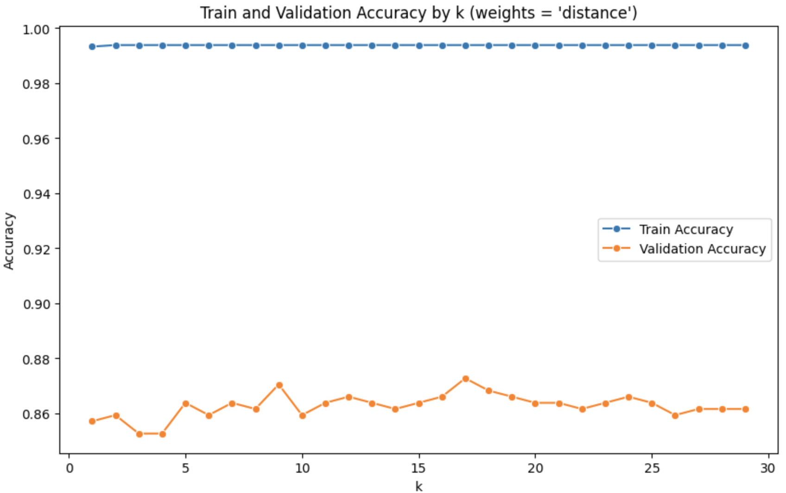

## 🎯 Project Overview

This project implements a **K-Nearest Neighbors (KNN)** model to classify customers based on a marketing campaign dataset. The goal is to predict whether customers will purchase a product in the company’s 6th marketing campaign, enabling efficient resource allocation and targeted marketing strategies.

### General Details

- **Project Name**: Customer Classification Using KNN
- **Objective**: Predict purchase decisions (1 for purchase, 0 for decline)
- **Data Source**: [Marketing Campaign Dataset](https://www.kaggle.com/datasets/rodsaldanha/arketing-campaign) from Kaggle

---

## Problem Definition

### Business Context

The company is launching its 6th marketing campaign to promote a new product line and aims to:

- Identify customers likely to buy for focused marketing efforts.
- Exclude unlikely buyers to minimize costs.
- Understand factors driving purchase decisions.

### Machine Learning Task

- **Task Type**: Binary classification
- **Input**: Customer attributes (e.g., income, past campaign responses, online purchases)
- **Output**: Binary label: 1 (purchase) or 0 (decline)

---

## Dataset Description

- **Source**: Marketing Campaign dataset from Kaggle
- **Size**: 2,240 customers from a phone-based pilot campaign
- **Labels**: 1 (purchase), 0 (decline)

| Field Name | Meaning |
| --- | --- |
| **ID** | Customer ID |
| **Year_birth** | Year of birth |
| **Education** | Education level |
| **Marital_status** | Marital status |
| **Income** | Annual household income |
| **Kidhome** | Number of children in the household |
| **Teenhome** | Number of teenagers in the household |
| **DtCustomer** | Date when the customer information was first recorded in the system |
| **Recency** | Number of days since the last purchase |
| **MntWines** | Amount spent on wine products in the past 2 years |
| **MntFishProducts** | Amount spent on fish products in the past 2 years |
| **MntMeatProducts** | Amount spent on meat products in the past 2 years |
| **MntFruits** | Amount spent on fruit products in the past 2 years |
| **MntSweetProducts** | Amount spent on sweet products in the past 2 years |
| **MntGoldProds** | Amount spent on luxury products in the past 2 years |
| **NumDealsPurchases** | Number of purchases with promotions |
| **NumStorePurchases** | Number of in-store purchases |
| **NumCatalogPurchases** | Number of purchases made via catalog |
| **NumWebPurchases** | Number of purchases made via the website |
| **NumWebVisitsMonth** | Number of website visits in the last month |
| **AcceptedCmp1** | 1 if the customer agreed to purchase in the first campaign, 0 if declined |
| **AcceptedCmp2** | 1 if the customer agreed to purchase in the second campaign, 0 if declined |
| **AcceptedCmp3** | 1 if the customer agreed to purchase in the third campaign, 0 if declined |
| **AcceptedCmp4** | 1 if the customer agreed to purchase in the fourth campaign, 0 if declined |
| **AcceptedCmp5** | 1 if the customer agreed to purchase in the fifth campaign, 0 if declined |
| **Complain** | 1 if the customer has complained about a product/service in the past 2 years, 0 otherwise |
| **Response (target)** | 1 if the customer accepted the last campaign, 0 if declined |

## Data Preparation

- **Splitting**: Divided into 80% training (X_train_scaled, y_train) and 20% validation (X_val_scaled, y_val) sets.
- **Normalization**: Scaled features for KNN’s Euclidean distance metric.
- **Feature Selection**: Retained 30 relevant features based on initial analysis.

## Exploratory Data Analysis (EDA)

- **Purpose**: Analyzed the dataset to identify patterns and potential predictors of purchase behavior before modeling.
- **Approach**: Examined distributions of numerical features (Income, NumWebPurchases, Age) and categorical features (AcceptedCmp1-5, Education) using summary statistics and visualizations.
- **Hypotheses**:
    - AcceptedCmp1-5: Prior campaign acceptance signals higher purchase likelihood.
    - Income: Greater income may increase buying potential.
    - NumWebPurchases: Frequent online purchases suggest receptiveness.
    - Age: Certain age groups may be more inclined to buy.
- **Findings**:
    - Positive AcceptedCmp5 responses strongly correlated with purchases.
    - Higher NumWebPurchases linked to increased buying tendency.
    - Income showed a moderate positive trend with purchases; Age varied by group (e.g., 30-50 more likely).

## Methodology

### Algorithm

- **K-Nearest Neighbors (KNN)**:
    - Distance metric: Euclidean (metric='euclidean)
    - Weighting: Tested uniform (equal) and distance (distance-based)

### Implementation Steps

- **Preprocessing**: Split data 80/20 and scaled features.
- **Training**: Tested k from 1 to 30, focusing on k=9 and k=17.
- **Tuning**: Evaluated performance, noting overfitting at k=17 with weights='distance'; preferred k=9 with weights='uniform'.
- **Feature Analysis**: Assessed feature impact on validation accuracy.

### Tools and Technologies

- Python, scikit-learn (KNN, scaling), pandas, numpy (data handling), matplotlib, seaborn (visualization)
- Environment: Jupyter Notebook

---

## Results

### Model Performance

- **At k=9 with weights='uniform'**: Balanced accuracy across training and validation (specific values pending refinement), minimal overfitting.
- **At k=17 with weights='distance'**: 99% training accuracy, 87% validation accuracy (8% gap, indicating overfitting).

**Visualization**:

- *Train vs. Validation Accuracy Plot*
 (at k=9)

- *Train vs. Validation Accuracy Plot (k*= 17  ****weights='distance')

### Key Features

| Feature | Importance Score | Interpretation |
| --- | --- | --- |
| AcceptedCmp5 | 0.008929 | Top predictor (past engagement) |
| AcceptedCmp1 | 0.006696 | Prior campaign response |
| Age | 0.006696 | Demographic factor |
| AcceptedCmp3 | 0.004464 | Additional campaign influence |
| Income | 0.002232 | Financial capacity |
| NumWebPurchases | 0.002232 | Online purchase behavior |

---

## Model Evaluation

### Strengths of the KNN Model

- **Simplicity**: Easy to implement and interpret, suitable for small datasets like this (2,240 samples).
- **EDA Alignment**: Feature importance results matched EDA hypotheses, enhancing reliability.
- **Flexibility**: Adjustable k and weighting options allow performance tuning.

### Weaknesses of the KNN Model

- **Overfitting Risk**: Evident at k=17 with weights='distance' (8% accuracy gap), requiring careful parameter selection.
- **Scalability**: Computationally intensive for larger datasets due to distance calculations.
- **Sensitivity to Noise**: Performance may degrade with irrelevant or noisy features.
 
